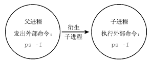

# Linux 命令行与 shell 脚本编程大全（第 3 版）

[toc]

## 第一部分 Linux 命令行

### 1. 初识 Linux Shell

linux 可划分为四部分：

- Linux 内核
  负责 系统内存管理、软件程序管理、硬件设备管理、文件系统管理
  - 内核不断在交换空间 和实际的物理内存之间 反复交换虚拟内存中的内容。
- GNU 工具
- 图形化桌面
- 应用软件

### 2. 走进 shell

略

### 3. 基本的 bash shell 命令

- 3.2 shell 提示符，包含了用户名 christine，和系统名 server01。

  - Ubuntu Linux
    christine@server01:~\$
  - CentOs
    [christine@server01 ~]\$

- 3.3 bash 手册，在命令行中查看帮助
  `man` 命令，`Manual pages` 的缩写。

```c
$ man <command_name>
$ man ls    /查看 ls 命令的帮助
$ man man   /查看 man 命令的帮助
```

> man 命令被分成 8 个区段

| 区段 | 说明                                      |
| ---- | ----------------------------------------- |
| 1    | 一般命令                                  |
| 2    | 系统调用                                  |
| 3    | 库函数，涵盖了 C 标准函数库               |
| 4    | 特殊文件（通常是/dev 中的设备）和驱动程序 |
| 5    | 文件格式和约定                            |
| 6    | 游戏和屏保                                |
| 7    | 杂项                                      |
| 8    | 系统管理命令和守护进程                    |

查看相应的区段可以 man 后加相应区段的数字再加命令即可，如：

```c
$ man 1 ls
```

> `info` 来获得更详细的帮助，
> `--help` 来快速查看某些具体参数，例如 `ls --help`。

- 3.4 浏览文件系统
  在根目录创建特别的目录-挂载点，用于分配额外存储设备的目录，虚拟目录会让这些文件出现在这些挂载点的目录中，但实际上他们却存在于另一个目录。

- 3.5 文件和目录列表

```c
$ ls -F     # -F 在列出的文件名称后加一符号；例如可执行档则加 "*", 目录则加 "/"
$ ls -a     # 显示所有文件
$ ls -R     # 递归显示所有文件 和 文件夹以及其目录下的所有文件（夹）

$ ls -F -R  # 等同于下面的命令
$ ls -FR

# 支持文件扩展匹配，(!) 可以排除不需要的文件。
$ ls -l ab?c*de[ef][g-k]l[!n]xyz
```

- 3.6 处理文件

  - 创建文件 或者 更新文件修改时间
    `$ touch file`

    - 只更新访问时间
      `$ touch -a file` # 查看访问时间需要用到参数： --time=atime
      `$ ll --time=atime file`

  - 复制文件
    `$ cp file1 file2 # 如果 file2 存在则直接覆盖`
    `$ cp -i file1 file2 # -i 参数为强制询问是否覆盖，但是 centos 的默认 alias 绑定了 cp='cp -i', 所以centos默认可以不加`

    - 复制文件夹
      `$ cp -R dir/ dir_mod/ # 复制 dir/ 的所有内容，到新的文件夹 dir_mod/ 下。`

  - 链接文件
    `$ ln -s file file_ln1 # file_ln1 为创建的软链接`
    file 和 file_ln1 并不是一个文件,通过 ls -i 查看 inode 编号。
    `$ ls -i *file`
    `$ ln -s file file_ln2 # file_ln1 和 file_ln2 是同一个文件。`

  - 文件重命名或者移动
    `$ mv file1 file2 #重命名`
    `$ mv file1 dir/file2 # 移动并改名`

- 3.7 处理目录

  - 创建目录
    `$ mkdir dir/`
    `$ mkdir -R dir/dir1/dir2/ # 同时创建多级目录和子目录`

  - 删除目录
    `$ rm -rf dir/`
    `$ rmdir dir/ # 删除一个空目录，不需要确认`

- 3.8 查看文件内容

  - 查看文件类型
    `$ file my_file.txt # 可以查看一切文件的文件类型`

  - 查看整个文件
    `$ cat -n(加入行号) -b(只在有文本的行加入行号) -T(不让制表符出现)`

  `$ more # 逐行查看文件，尤其是大文件。`
  `$ less # 同more一样，但是更好用`

  - 查看部分文件

    - tail 命令，默认查看最后 10 行
      `$ tail -n 2 a.log; tail -2 a.log # 查看最后两行,`
      `$ tail -f a.log # 实时显示文件`

    - head 命令，默认查看开头 10 行
      `$ head -5 a.log`

### 4. 更多的 bash shell

- 4.1 监测程序

  - 进程 `$ ps # 默认情况下只会显示 当前控制台下属于当前用户的进程。`
    `$ ps -ef # 查看所有进程`
    `ps -ef --forest # --forest 参数层级结构显示进程和父进程的关系。`

  - 实时监测进程 `$ top`
    第一行显示：当前时间、系统运行时间、登陆用户数、平均负载（分别是 1 分钟、5 分钟、15 分钟，通常，如果系统的负载值超过了 2，就说明系统比较繁忙了。）
    第二行显示：Tasks(处在 运行、休眠、停止或者僵化状态的进程)、
    第三行显示：CPU 的概况，top 根据进程的属主（用户还是系统）和进程的状态（运行、空闲还是等待）将 CPU 利用率分成几类输出。
    第四五行显示：系统内存的状态、和系统交换空间（第五行）。
    下面的几行就是：当前运行中的进程的详细列表，d 修改刷新间隔，f 修改显示的字段，q 退出。

  - 结束进程 `$ kill`

  ```c
  $ kill -s HUP 1234  # 强制终止，-s 参数支持指定其他信号。
  $ killall http*     # killall 结束所有匹配的进程，支持通配符。
  $ pkill http        # pkill命令可以按照进程名杀死进程。
  ```

- 4.2 监测磁盘空间

  - 挂载存储媒介 `$ mount # 输出当前系统上挂载的设备`,使用新的存储媒介之前，需要挂载到系统的虚拟目录下。
    手动挂载设备，需要 root 身份登陆：

  ```c
  $ mount -t type device directory       # type 参数指定磁盘被格式化的文件系统类型。vfat(windows 长文件系统)、ntfs(windows 中的高级文件系统)、iso(标准的CR-ROM文件系统)等。
  $ mount -t vfat /dev/sdb1 /media/disk
  ```

  - `umount` 卸载
    `$ umount /media/disk # umount 的命令不能在挂载的目录下执行卸载`

  - 使用 df 命令
    `$ df -h`
  - 使用 du 命令（递归显示所有文件夹）

  ```c
  $ du -s -c -h -BM --max-depth=0 /opt/
  # -s  只显示总和的大小
  # -c  显示所有文件大小（包含子目录）并列出总和
  # --max-depth=x 中的 x 代表深入第几级目录，0 就是不深入。
  $ du -hc --max-depth=1 /opt    # 常用的格式
  $ du -cBM /opt | sort -nr | head -5   # 对整个目录里进行大小筛选，需要用 -Bx 参数统一格式。sort -nr ,从小到大、并反向排序。
  ```

- 4.3 处理数据文件

  - 排序数据 `$ sort # 默认对字符排序`

  ````c
  $ sort -n file1     # ，数字识别成数字，并按值排序，
  # -M 参数: 按月份来排序
  # -c 检查排序并报告
  # -g 按通用数值来排序（跟-n不同，把值当浮点数来排序，支持科学计数法表示的值）
  # -k (--key=POS1[,POS2]) : 排序从POS1位置开始；如果指定了POS2的话，到POS2位置结束
  # -r 反向排序
  # -t 指定分隔符

  # -k 和 -t 对按字段分隔的数据进行排序很有用
  $ sort -t ":" -k 3(第三个字段) -n /etc/passwd

  - 搜索数据  `grep [options] pattern [file]` grep 的输出就是包含了匹配模式的行，所以是按行匹配。

  ```c
  $ grep -v word file  # 在file 文件中 搜索 word 关键字，-v 参数为反向搜索。
  $ grep -n work file  # -n 显示行号
  $ grep -e word1 -e word2 -e word3 file    # -e 参数可以指定多种匹配模式，这个匹配了 file 中包含 word1-3 的行
  $ grep -o word file     # 只输出file中的 word 内容。

  $ egrep   # 支持POSIX扩展正则表达式
  $ fgrep   # 支持将匹配模式指定为用换行符分隔的一列固定长度的字符串。

  - 归档解压缩数据  `$ tar function [options] object1 object2 ...`

  ```c
  $ tar -cvf test.tar /test1 /test2 ...     # 将 testx 的文件夹 归档到 test.tar .
  $ tar -tf test.tar(.gz)    # 查看文件里的内容，-t: --list，也可以查看 *.tgz 文件中的内容。
  $ tar -jcvf fillename.tgz /dir1 /dir2 # 压缩成 bzip2 (.bz2) 的文件。`-j   #将输出重定向给bzip2命令来压缩内容`
  $ tar -zxvf filename.tgz    # 解压 gzip (.gz) 的文件。`-g   # 将输出重定向给gzip命令来压缩内容`

  # -r --append 追加文件到已有tar归档文件末尾
  # -C dir 切换到指定目录
  $ tar -xf file.tar -C /opt/   # 解压到指定文件夹

  # -p 保留所有文件权限
  ````

### 5. 理解 shell

- 5.1 shell 的类型
  `GNU bash shell` 是最广泛流行的一种 shell，许多发行版使用软链接将默认的系统 shell 设置成 bash shell:

```shell
$ ll /bin/sh
lrwxrwxrwx 1 root root 4 4月  17 20:01 /bin/sh -> bash

# 可以使用发行版中所有可用的 shell，
$ /bin/dash
$
$ exit      # 直接退出即可
exit
```

- 5.2 shell 的父子关系

  - 子 shell
    > 

  退出 子 shell 使用 `exit` 即可。

  - 进程列表
    在一行中一次执行一系列的任务，使用（;）即可。
    `$ pwd; ls ; cd /etc ; pwd ; cd ; pwd`
    **但命令列表要想成为进程列表，这些命令必须包含在括号里。**
    `$ (pwd; ls ; cd /etc ; pwd ; cd ; pwd) # 括号的加入使命令列表变成了进程列表，生成了一个子shell来执行对应的命令。进程列表是一种分组，另一种分组是使用花括号（格式为{ command; },结尾有分号），但花括号并不会创建子进程。`

    - 要想知道是否生成了子 shell，得借助一个使用了环境变量的命令。
      `$ echo $BASH_SUBSHELL # 如果该命令返回0，就表明没有子shell，而返回的数字就代表了当前的 child shell。`[什么是子 shell](https://www.cnblogs.com/ziyunfei/p/4803832.html)

  - 后台模式
    后台模式就是运行命令可以咋处理命令的同时让出 CLI ，以供他用。
    `$ sleep 10 # 将会话暂停10秒钟，然后返回 shll CLI 提示符。`
    要想将命令置入后台模式，可以在命令末尾加上字符 `&`。

  ```bash
  $ sleep 3000 &
  [1] 1234    # [1] 为后台作业（background job）号，1234为进程号。
  $ ps -f   # 查看进程
  $ jobs -l     # jobs 查看后台进程，-l 参数查看
  $ (sleep 2 ; echo $BASH_SUBSHELL ; sleep 2)&    # 将进程列表放入后台，既可以在子shell中进行繁重的处理工作，同时也不会让子shell的I/O受制于终端。
  $ (tar -cf Rich.tar /home/rich ; tar -cf My.tar /home/christine)&

  ---
  # 协程命令 `coproc`
  $ coproc My_Job { sleep 10; }   # 可以通过扩展语法设置名称为 My_Job, 如果不设置，为默认的 COPROC。
  # 扩展语法必须确保在第一个花括号（ {）和命令名之间有一个空格。还必须保证命令以分号（ ;）结尾。另外，分号和闭花括号（ }）之间也得有一个空格。
  ```

  **记住，生成子 shell 的成本不低，而且速度还慢。创建嵌套子 shell 更是火上浇油！**

- 5.3 理解 shell 的内建命令

  - 外部命令（文件系统命令，存在于 bash shell 之外的程序。外部命令通常存在于 `/bin、/usr/bin、/sbin、/usr/sbin 中。`）
    `$ which ps 或者 $ type -a ps # ps 是一个外部命令，可以使用 which 和 type 命令来找到它。`
    当外部命令执行时，会创建出一个子进程。这种操作被称为衍生。外部命令的衍生过程:
    > 

  当进程必须执行衍生操作时，它需要花费时间和精力来设置新子进程的环境。所以说，外部命令多少还是有代价的。

  - 内建命令

    - 内建于 bash shell 的命令。使用 `type` 命令查看是否是内建的。
    - 有些命令有多种实现，既有内建、也有外部命令。可以使用 -a 选项查看。例如 `echo、pwd` 等。
    - 对于有多种实现的命令，如果想要使用其外部命令实现，直接指明对应的文件就可以了。例如，要使用外部命令 pwd，可以输入/bin/pwd。

  - 使用 history 命令
    `$ !! # 使用上一条命令，`
    `$ !20` # 执行 history 列表中的第 20 条命令。`

    - 保存在隐藏文件.bash_history 中，但 bash 命令的历史纪录是先放在内存中的，shell 退出时才会写入到历史文件中。（可以使用 `$ history -a` 强制写入）

  - 命令别名，使用 `$ alias -p` 查看已有的别名。
    `$ alias li='ls -li' # 可以直接创建属于自己的别名。`
    **一个别名仅在它所被定义的 shell 进程中才有效**,但可以使用环境变量实现。

### 6. 使用 linux 环境变量

- 6.1 环境变量
  bash shell 使用 `环境变量` 的特性来存储有关 shell 会话和工作环境的信息。bash shell 中，环境变量分为：全局变量、局部变量。

  - 全局环境变量
    查看全局变量可以使用 `$ env | printenv`, 要显示个别环境变量的值，可以使用 printenv 和 echo(变量前加\$)：

  ```bash
  $ printenv HOME
  /home/Christine
  $ env HOME
  env: HOME: No such file or directory
  $ echo $HOME      # 加入$ 可以让变量作为命令行参数。
  /home/Christine
  ```

  - 局部环境变量（没有相关的命令）
    使用 `$set` 查看所有的系统变量、局部变量和用户自定义变量。

- 6.2 设置用户自定义变量
  使用小写的字母来定义变量来区分和避免修改系统变量,带空格的白变量使用单引号，且变量名和值以及等号之间不能有空格。
  `$ my_variable='Hello world'`
  `$ echo $my_variable`
  `Hello world`
  定义的变量只在当前的 shell 可用。

  - 设置全局变量 `export`

  ```bash
  $ my_variable="I am Global now"
  $ export my_variable
  $ echo $my_variable
  I am Global now
  $ bash
  $ echo $my_variable
  I am Global now
  $ exit
  exit
  $ echo $my_variable
  I am Global now
  ```

但是如果在 child shell 中导出变量就无法在 父 shell 中使用。

- 6.3 删除环境变量 `$ unset`
  `使用 unset 时，不要使用\$.

- 6.4 默认的 shell 变量
  略

- 6.5 设置 PATH 环境变量（可以在虚拟目录的任何位置执行程序）

```bash
$ echo $PATH   # 所有的目录使用 ： 分隔。
/usr/local/sbin:/usr/local/bin:/usr/sbin:/usr/bin:/root/bin
$ PATH=$PATH:/home/scripts   # 新添加你的环境变量直接引用PATH 即可。
$ PATH=$PATH:.    # 使用 . 来找到当前目录更加方便。
```

- 6.6 定位系统环境变量
  默认情况下 bash 会在几个文件中查找命令。这些文件叫做 启动文件 或 环境文件。bash 检查的启动文件取决于你启动 bash shell 的方式。

  - 登陆 shell，bash shell 会作为登录 shell 启动。
    登陆时，shell 会从 5 个不同的文件读取命令：

  ```bash
  /etc/profile            # 系统上默认的 bash shell的主启动文件
  $HOME/.bash_profile
  $HOME/.bashrc           # 一是查看/etc目录下通用的bashrc文件，二是为用户提供一个定制自己的命令别名（参见第5章）和私有脚本函数（将在第17章中讲到）的地方。
  $HOME/.bash_login
  $HOME/.profile
  ```

  `$HOME` 目录下的启动文件：提供一个用户专属的启动文件来定义该用户所用到的环境变量。
  shell 会按照按照下列顺序，运行第一个被找到的文件，余下的则被忽略：

  ```bash
  $HOME/.bash_profile
  $HOME/.bash_login
  $HOME/.profile

  # 注意，$HOME/.bashrc ，该文件通常通过其他文件运行的。
  ```

  - 交互式 shell 进程（比如是在命令行提示符下敲入 bash 时启动）
    只会检查用户 HOME 目录中的 .bashrc 文件。

  - 非交互式 shell（系统执行 shell 脚本时，用的就是这种 shell。）

- 6.7 数组变量（可以作为数组使用，能够单独引用，也可以作为整个数组使用。）

```bash
$ mynum=(one two three four five)
$ echo $mynum           # 默认只显示第一值
one
$ echo ${mynum[2]}      # 索引值用方括号括起来
three
$ echo ${mynum[*]}      # 显示所有的值
one two three four five

$ unset mtnum[2]        # 删除索引值
$ echo ${mynum[*]}
one two three four five
$ unset mynum           # 删除所有值
$ echo $mynum           # 值已经删除

```

### 7. 理解 linux 文件权限

- 7.1 linux 的安全性
  linux 安全系统的核心时用户账户，每个用户创建时都会分配唯一的用户 id (User id,UID), 但登陆系统时用的不是 UID ，而是用户名。

  - /etc/passwd 文件
    root 账户固定的 id 为 0, passwd 文件包括了以下信息:

  ```bash
  登录用户名
  用户密码
  用户账户的UID（数字形式）
  用户账户的组ID（ GID）（数字形式）
  用户账户的文本描述（称为备注字段）
  用户HOME目录的位置
  用户的默认shell
  ```

  - /etc/shadow 文件
    `/etc/shadow文件对Linux系统密码管理提供了更多的控制。`

  - 添加新用户 `$ useradd -m test # 可以一次性创建用户账户及设置用户 HOME 目录结构`
    系统默认值被设置在/etc/default/useradd 文件中：

  ```bash
  $ useradd -D
  GROUP=100
  HOME=/home
  INACTIVE=-1
  EXPIRE=
  SHELL=/bin/bash
  SKEL=/etc/skel          # 允许管理员创建一个默认的 HOME 目录配置模板，
  CREATE_MAIL_SPOOL=yes

  #新用户会被添加到GID为100的公共组；
  #新用户的HOME目录将会位于/home/loginname；
  #新用户账户密码在过期后不会被禁用；
  #新用户账户未被设置过期日期；
  #新用户账户将bash shell作为默认shell；
  #系统会将/etc/skel目录下的内容复制到用户的HOME目录下；
  #系统为该用户账户在mail目录下创建一个用于接收邮件的文件。

  $ useradd -m test     # 默认情况下， useradd命令不会创建HOME目录，但是-m命令行选项会使其创建HOME目录。(centos7默认可以)
  $ useradd -D -s /bin/tsch     # 可以使用 -D 选项指定一个值来修改系统默认的新用户设置。
  -b default_home 更改默认的创建用户HOME目录的位置
  -e expiration_date 更改默认的新账户的过期日期
  -f inactive 更改默认的新用户从密码过期到账户被禁用的天数
  -g group 更改默认的组名称或GID
  -s shell 更改默认的登录shell
  ```

  - 删除用户
    `$ userdel -r user_name # -r 参数删除所有和用户关联的 HOME 目录以及邮件目录。`

  - 修改用户信息的工具

  | 命令     | 描述                                                     |
  | -------- | -------------------------------------------------------- |
  | usermod  | 修改用户账户的字段，还可以指定主要组以及附加组的所属关系 |
  | passwd   | 修改已有用户的密码                                       |
  | chpasswd | 从文件中读取登录名密码对，并更新密码                     |
  | chage    | 修改密码的过期日期                                       |
  | chfn     | 修改用户账户的备注信息                                   |
  | chsh     | 修改用户账户的默认登录 shell                             |

      - usermod： -c修改备注字段，-e修改过期日期，-g修改默认的登录组 ，-l修改用户账户的登录名，-L锁定账户，使用户无法登录，-p修改账户的密码，-U解除锁定，使用户能够登录。
      - passwd 和 chpasswd：修改用户密码最简便的方式，每个用户都可以更改自己的密码，root 可以更改任何一个人。 `-e 选项：可以强制用户下次登陆时修改密码。`
      - chsh、chfn 和 chage
      chsh、 chfn和chage工具专门用来修改特定的账户信息。

      ```bash
      $ chsh -s /bin/csh test     # 修改默认登陆shell
      $ chfn test                 # chfn命令提供了在/etc/passwd文件的备注字段中存储信息的标准方法。
      $ chage -dEImW YYYY-MM-DD   # chage命令用来帮助管理用户账户的有效期。chage命令中有个好用的功能是设置账户的过期日期(-E)。

- 7.2 使用 linux 组
  当一个用户在/etc/passwd 文件中指定某个组作为默认组时，用户账户不会作为该组成员再出现在/etc/group 文件中。

  - 创建新组

  ```bash
  $ groupadd world      # 创建用户组，默认没有用户被分配到该组。
  $ usermod -G world test   # 为用户账户分配组时要格外小心。如果加了-g选项，指定的组名会替换掉该账户的默认组。 -G选项则将该组添加到用户的属组的列表里，不会影响默认组。
  ```

  - 修改组
    `groupmod命令可以修改已有组的GID（加-g选项）或组名（加-n选项）。`
    `$ groupadd -n worldd world # 修改组名时， GID和组成员不会变，只有组名改变。由于所有的安全权限都是基于GID的，可以随意改变组名而不会影响文件的安全性。`

- 7.3 理解文件权限
  使用 ls 命令 输出文件的权限。

  - 使用文件权限符
    第一个字段就是描述文件和目录权限的编码。

  ```bash
  $ ls -l
  $ ll /etc/ |head
  total 1232
  -rw-r--r--.  1 root root     16 Jul 28  2018 adjtime
  -rw-r--r--.  1 root root   1518 Jun  7  2013 aliases
  -rw-r--r--.  1 root root  12288 Jul 28  2018 aliases.db
  drwxr-xr-x.  2 root root    236 Jul 28  2018 alternatives
  -rw-------.  1 root root    541 Nov 20  2018 anacrontab
  drwxr-xr-x.  4 root root   4096 Jul 12 04:38 asciidoc

  # 第一个符号。-代表文件、d代表目录、l代表链接、c代表字符型设备、b代表块设备、n代表网络设备、
  # 后面 三组三个符号 分别为：对象的属主，对象的属组 以及 系统其他用户。
  ```

  - 默认文件权限 {1（001）执行，2（010）写入，4（100）读取。}

  | 权限 | 二进制值 | 八进制值 | 描 述            |
  | ---- | -------- | -------- | ---------------- |
  | ---  | 000      | 0        | 没有任何权限     |
  | --x  | 001      | 1        | 只有执行权限     |
  | -w-  | 010      | 2        | 只有写入权限     |
  | -wx  | 011      | 3        | 有写入和执行权限 |
  | r--  | 100      | 4        | 只有读取权限     |
  | r-x  | 101      | 5        | 有读取和执行权限 |
  | rw-  | 110      | 6        | 有读取和写入权限 |
  | rwx  | 111      | 7        | 有全部权限       |

  `$ umask 026 # umask 命令可以显示和设置默认的权限，比如这个就把默认的文件权限设置成了 640.`

- 7.4 改变安全性设置
  改变权限，`$ chomd 命令。`

  - 改变权限

  ```bash
  $ chomd options mode file
  $ chmod 760 file    # 修改权限为 760 （rwx rw- ---）
  $ [ugoa…][[+-=][rwxXstugo…]   # u 代表用户、g 代表组、o 代表其他、a 代表上述所有,
  # 下一步的 + - = 为增减和等于。
  # X：如果对象是目录或者它已有执行权限，赋予执行权限。
  # s：运行时重新设置UID或GID。
  # t：保留文件或目录。
  # u：将权限设置为跟属主一样。
  # g：将权限设置为跟属组一样。
  # o：将权限设置为跟其他用户一样。

  $ chmod o+r file    # 不论其他的用户在这一级别之前有什么权限， o+r 都添加一个读取权限。
  $ chmod u-x file    #  u-x 移除了 属主已有的可执行权限。

  - 改变所属关系
  使用 `$ chown 改变文件属主`，使用 `$ chgrp 改变文件默认属组`。
    - `$ chown options owner[.group] file   # 可使用用户名或 UID 来指定`
    `$ chmod test.share file    # 更改 file 文件属主为 test 用户和 share 属组。`
    `# 如果你的Linux系统采用和用户登录名匹配的组名，可以只用一个条目就改变二者。`    `$ chmod test.share file | ls -l`
    `-rw-r--r--. 1 test test 273 Oct 17 14:36 file`

    - `$ chgrp test. newfile`
    更改文件或目录的默认属组。

  ```

- 7.5 共享文件
  Linux 系统上共享文件的方法是创建组。如果共享目录，需要改变其用户所在的访问权限，这将变得异常的复杂。
  Linux 还为每个文件和目录存储了 3 个额外的信息位。

  - 设置用户 ID（ SUID） ：当文件被用户使用时，程序会以文件属主的权限运行。
  - 设置组 ID（ SGID） ：对文件来说，程序会以文件属组的权限运行；对目录来说，目录中创建的新文件会以目录的默认属组作为默认属组。
  - 粘着位：进程结束后文件还驻留（粘着）在内存中。

  - chmod SUID、 SGID 和粘着位的八进制值：

  | 二进制值 | 八进制值 | 描述                    |
  | -------- | -------- | ----------------------- |
  | 000      | 0        | 所有位都清零            |
  | 001      | 1        | 粘着位置位              |
  | 010      | 2        | SGID 位置位             |
  | 011      | 3        | SGID 位和粘着位都置位   |
  | 100      | 4        | SUID 位置位             |
  | 101      | 5        | SUID 位和粘着位都置位   |
  | 110      | 6        | SUID 位和 SGID 位都置位 |
  | 111      | 7        | 所有位都置位            |

因此，要创建一个共享目录，使目录里的新文件都能沿用目录的属组，只需将该目录的 SGID
位置位。

```bash
$ mkdir testdir
$ ls -l
drwxrwxr-x 2 rich rich 4096 Sep 20 23:12 testdir/
$ chgrp shared testdir
$ chmod g+s testdir
$ ls -l
drwxrwsr-x 2 rich shared 4096 Sep 20 23:12 testdir/
$ umask 002
$ cd testdir
$ touch testfile
$ ls -l
total 0
-rw-rw-r-- 1 rich shared 0 Sep 20 23:13 testfile
$
```

首先，用 mkdir 命令来创建希望共享的目录。然后通过 chgrp 命令将目录的默认属组改为包含所有需要共享文件的用户的组（你必须是该组的成员）。最后，将目录的 SGID 位置位，以保证目录中新建文件都用 shared 作为默认属组。

为了让这个环境能正常工作，所有组成员都需把他们的 umask 值设置成文件对属组成员可写。在前面的例子中， umask 改成了 002，所以文件对属组是可写的。

### 8. 管理文件系统

- 探索 Linux 文件系统

  - 基本的 linux 文件系统
    ext 文件系统【扩展文件系统（ extended filesystem，简记为 ext）】、ext2 文件系统。

  - 日志文件系统
    ext3、ext4、reiser、JFS、XFS 文件系统

  - 写时复制文件系统
    ZFS

- 8.2 操作文件系统

  - 创建分区

  ````bash
  $ sudo fdisk /dev/sdb/  # 必须指定存储设备的设备名，以及拥有超级用户权限。
  Command (m for help): p   # 使用 p 命令显示存储设备的详细信息。
  Command (m for help): n    # 创建新的分区
  Command action
  e extended        # 扩展分区（ extended partition）
  p primary partition (1-4)   # 主分区（ primary partition）

  - 创建文件系统
  `$ type mkfs.ext4   # 查看是否安装了工具`

  ```bash
  $ ls /mnt
  $
  $ sudo mkdir /mnt/my_partition
  $
  $ ls -al /mnt/my_partition/
  $
  $ ls -dF /mnt/my_partition
  /mnt/my_partition/
  $
  $ sudo mount -t ext4 /dev/sdb1 /mnt/my_partition
  $
  $ ls -al /mnt/my_partition/
  total 24
  drwxr-xr-x. 3 root root 4096 Jun 11 09:53 .
  drwxr-xr-x. 3 root root 4096 Jun 11 09:58 ..
  drwx------. 2 root root 16384 Jun 11 09:53 lost+found
  $
  ````

  - 文件系统的检查与修复 `$ fsck options filesystem`
    fsck 命令能够检查和修复大部分类型的 Linux 文件系统。

- 8.3 逻辑卷管理

  - 逻辑卷管理环境

    > 
    > 第三个物理硬盘有一个未使用的分区。通过逻辑卷管理，你随后可以轻松地将这个未使用分区分配到已有卷组：要么用它创建一个新的逻辑卷，要么在需要更多空间时用它来扩展已有的逻辑卷。
    > 类似地，如果你给系统添加了一块硬盘，逻辑卷管理系统允许你将它添加到已有卷组，为某个已有的卷组创建更多空间，或是创建一个可用来挂载的新逻辑卷。这种扩展文件系统的方法要好用得多！

  - linux 中的 LVM
    略

### 9. 安装软件程序

linux 上有各种 `包管理工具（package management system, PMS）`，用来进行软件安装、管理和删除的命令行工具。PMS 利用一个数据库来记录各种相关的内容：

1. Linux 系统上已安装了什么软件包；
2. 每个包安装了什么文件；
3. 每个已安装软件包的版本。

- 9.1 包管理基础
  包管理基础软件包放在服务器上，可以利用本地的 PMS 工具通过互联网访问。

软件包通常会依赖其他的安装包，为了正常运行，需要提前安装在系统中，PMS 工具可以自动检测这些依赖关系，并在安装软件包之前安装好额外的安装包。

- 9.2 基于 Debian 的系统
  略

- 9.3 基于 Red Hat 的系统
  这里只需要用到 yum , 需要使用 root 用户登陆，或者使用 sudo 命令。

  - 列出已安装的包
    `$ yum list installed ; yum list xterm # 查看已安装列表，和是否安装了某个软件`
    如果需要找出系统上的某个特定文件属于哪个软件包，只需要输入:
    `$ yum provides /etc/yum.conf # 查找配置文件 /etc/yum.conf 的归属`

  - 安装软件
    `$ yum install -y package_name # -y 参数可以跳过确认直接安装。`
    `$ yum localinstall package_name.rpm # 也可以用 yum 本地安装rpm 包。`

  - 更新软件

  ```bash
  $ yum list updates    # 记住 updates 末尾有 s
  $ yum update package_name     # 单独更新一个包
  $ yum update          # 更新所有的yum包
  ```

  - 用 yum 卸载软件

  ```bash
  $ yum remove package_name     # 只删除软件包，保留配置文件和数据文件。
  $ yum erase package_name      # 删除软件和它的所有数据。
  ```

  - 处理损坏的包依赖关系
    在安装多个软件包的时候，某个包的软件的依赖关系可能会被另外一个包的安装覆盖掉。这个叫做 `损坏的包依赖关系（broken dependency）`。可以使用下面的命令：

  `$ yum clean all # 之后 $ yum update 试试`

  `$ yum deplist package_name # 显示一个软件包的依赖关系`

  `$ yum update --skip-broken # 忽略依赖关系，继续更新其他的软件包。`

  - yum 软件仓库
    `$ yum repolist # 显示正在使用的 yum 仓库`
    yum 仓库的定义文件放至在 `/etc/yum.repos.d/` 目录下.

- 9.4 从源码安装
  1. ./configure 是用来检测你的安装平台的目标特征的。比如它会检测你是不是有 CC 或 GCC，并不是需要 CC 或 GCC，它是个 shell 脚本。
  2. make 是用来编译的，它从 Makefile 中读取指令，然后编译。
  3. make install 是用来安装的，它也从 Makefile 中读取指令，安装到指定的位置。

```bash
$ tar -xzvf sysstat-11.1.1.tar.gz     # 解压到当前目录
$ cd sysstat-11.1.1
$ ./configure --prefix=/uer/local/sysstat       # 这一步一般用来生成 Makefile，为下一步的编译做准备，你可以通过在 configure 后加上参数来对安装进行控制，如路径等。
$ make      # 这一步为编译，创建可执行文件。
$ sudo make install    # 这个命令用来安装，这一步需要 root 权限（需要向系统写入文件）。
```

> 利用 configure 所产生的 Makefile 文件有几个预设的目标可供使用，其中几个重要的简述如下：
>
> - make all：产生我们设定的目标，即此范例中的可执行文件。只打 make 也可以，此时会开始编译原始码，然后连结，并且产生可执行文件。
> - make clean：清除编译产生的可执行文件及目标文件(object file，\*.o)。
> - make distclean：除了清除可执行文件和目标文件外，把 configure 所产生的 Makefile 也清除掉。
>   -make install：将程序安装至系统中。如果原始码编译无误，且执行结果正确，便可以把程序安装至系统预设的可执行文件存放路径。如果用 bin_PROGRAMS 宏的话，程序会被安装至/usr/local/bin 这个目录。
> - make dist：将程序和相关的档案包装成一个压缩文件以供发布。执行完在目录下会产生一个以 PACKAGE-VERSION.tar.gz 为名称的文件。 PACKAGE 和 VERSION 这两个变数是根据 configure.in 文件中 AM_INIT_AUTOMAKE(PACKAGE，VERSION)的定义。在此范例中会产生 test-1.0.tar.gz 的档案。
> - make distcheck：和 make dist 类似，但是加入检查包装后的压缩文件是否正常。这个目标除了把程序和相关文件包装成 tar.gz 文件外，还会自动把这个压缩文件解开，执行 configure，并且进行 make all 的动作，确认编译无误后，会显示这个 tar.gz 文件可供发布了。这个检查非常有用，检查过关的包，基本上可以给任何一个具备 GNU 开发环境-的人去重新编译。

### 10. 使用编辑器

> 本章只记录一些自己没有注意到的点。

- 10.1 vim 编辑器

  - vim 基础
     h：左移一个字符。
     j：下移一行（文本中的下一行）。
     k：上移一行（文本中的上一行）。
     l：右移一个字符。
     PageDown（或 Ctrl+F）：下翻一屏。
     PageUp（或 Ctrl+B）：上翻一屏。
     G：移到缓冲区的最后一行。
     num G：移动到缓冲区中的第 num 行。
     gg：移到缓冲区的第一行。

  - 编辑数据

  vim 编辑命令
  | 命令 | 描述 |
  | ---- | ---------------------------------------------------- |
  | x | 删除当前光标所在位置的字符 |
  | dd | 删除当前光标所在行 |
  | dw | 删除当前光标所在位置的单词 |
  | d\$ | 删除当前光标所在位置至行尾的内容 |
  | J | 删除当前光标所在行行尾的换行符（拼接行） |
  | u | 撤销前一编辑命令 |
  | a | 在当前光标后追加数据 |
  | A | 在当前光标所在行行尾追加数据 |
  | r | char 用 char 替换当前光标所在位置的单个字符 |
  | R | text 用 text 覆盖当前光标所在位置的数据，直到按下 ESC 键 |

  推荐阅读：[简明 vim 练级攻略](https://coolshell.cn/articles/5426.html)

- 10.x ---
  后面的编辑器略。

## 第二部分 shell 脚本编程基础

### 11. 构建基本脚本

- 11.1 使用多个命令
  `$ date ; who # 使用 分号 ; 将多个命令彼此分隔，命令顺序执行，没有依赖关系。`

- 11.2 创建 shell 脚本文件
  `#!/bin/bash # 井号'#'用作注释行，shell 不会处理注释行。文件的第一行是个例外，# 后的 ! 会告诉用哪个shell 来执行脚本。`

`$ chmod u+x test1 # 给属主添加执行脚本的权限。`

- 11.3 显示消息 `$ echo`
  `$ echo -n "This's my life." # -n 输出显示行号，使用双引号将文字中带有单引号的内容括起来。`

- 11.4 使用变量

  - 环境变量
    `set` 命令查看环境变量，使用 \$ 来引用存在的环境变量，如 `$HOME`。

  - 用户变量
    用户变量可以是任何由字母、数字或下划线组成的文本字符串，长度不超过 20 个，并且区分大小写。
    引用一个变量值时需要使用美元符，而引用变量来对其进行赋值时则不要使用美元符。
    `$ value1=10 ; value2=$value1 ; echo value2 # 输出 10`

  - 命令替换（shell 脚本中最有用的特性之一就是可以从命令输出中提取信息，并将其赋给变量。）
    有两种方法：
    1. 反引号（\`）: dir=\`pwd\` ; today=`date +%Y%m%d` （注意此时的数据已经定义给变量，不会改变，直到下一次定义。）
    2. $()格式： dir=$(pwd) ; \$today=(date +%Y%m%d)

- 11.5 重定向输入和输出

  - 输出重定向
    `$ command > outputfile # 将屏幕的打印信息输出到文件`

  `$ date > test ; ll test # 此刻的日期信息就会输出到 test 文件`

  `$ who >> test ; ll test # 将 who 输出的内容追加到test 文件最后`

  - 输入重定向

  ```bash
  $ commond < inputfile    # 将文件的内同重定向到命令。
  $ wc < test.txt ，输出  2 11 60     # wc 命令可以输出三个值，文本的行数、词数、字节数。

  # 内联输入重定向（<<）,结尾的 EOF 可以是任何字段。
  $ commond << EOF
  > data
  > EOF
  $ cat << EOF > test.sh  (或者 cat >test.sh << EOF)
  > 123123123
  > asdfasdfasdf
  > EOF

  ```

- 11.6 管道
  有时候需要将一个命令的输出作为另一个命令的输入，则可以使用管道。 `command1 | command2`

这两个命令是依次执行，而是、同时运行；在第一个命令产生输出的同时，输出会被立即送给第二个命令。数据传输不会用到任何中间文件和缓冲区。

`$ rpm -qa | sort # 将 rpm -qa 命令的输出送入 sort 命令来产生结果。`

- 11.7 执行数学运算

  - 11.7.1 expr 命令

  expr 命令操作符:

  | 操作符                   | 描述                                                                |
  | ------------------------ | ------------------------------------------------------------------- |
  | ARG1                     | ARG2                                                                | 如果 ARG1 既不是 null 也不是零值，返回 ARG1；否则返回 ARG2 |
  | ARG1 & ARG2              | 如果没有参数是 null 或零值，返回 ARG1；否则返回 0                   |
  | ARG1 < ARG2              | 如果 ARG1 小于 ARG2，返回 1；否则返回 0                             |
  | ARG1 <= ARG2             | 如果 ARG1 小于或等于 ARG2，返回 1；否则返回 0                       |
  | ARG1 = ARG2              | 如果 ARG1 等于 ARG2，返回 1；否则返回 0                             |
  | ARG1 != ARG2             | 如果 ARG1 不等于 ARG2，返回 1；否则返回 0                           |
  | ARG1 >= ARG2             | 如果 ARG1 大于或等于 ARG2，返回 1；否则返回 0                       |
  | ARG1 > ARG2              | 如果 ARG1 大于 ARG2，返回 1；否则返回 0                             |
  | ARG1 + ARG2              | 返回 ARG1 和 ARG2 的算术运算和                                      |
  | ARG1 - ARG2              | 返回 ARG1 和 ARG2 的算术运算差                                      |
  | ARG1 \* ARG2             | 返回 ARG1 和 ARG2 的算术乘积                                        |
  | ARG1 / ARG2              | 返回 ARG1 被 ARG2 除的算术商                                        |
  | ARG1 % ARG2              | 返回 ARG1 被 ARG2 除的算术余数                                      |
  | STRING : REGEXP          | 如果 REGEXP 匹配到了 STRING 中的某个模式，返回该模式匹配            |
  | match STRING REGEXP      | 如果 REGEXP 匹配到了 STRING 中的某个模式，返回该模式匹配            |
  | substr STRING POS LENGTH | 返回起始位置为 POS（从 1 开始计数）、长度为 LENGTH 个字符的子字符串 |
  | index STRING CHARS       | 返回在 STRING 中找到 CHARS 字符串的位置；否则，返回 0               |
  | length STRING            | 返回字符串 STRING 的数值长度                                        |
  | + TOKEN                  | 将 TOKEN 解释成字符串，即使是个关键字                               |
  | (EXPRESSION)             | 返回 EXPRESSION 的值                                                |

  `$ expr 5 \* 3 #当 expr 的命令操作符在shell 中另有含义（比如 * ）时，需要进行转义。`

  - 使用方括号(\$[ operation ])
    `$ var1=$[1 + 5]`
    `$ var4=$[$var3 * ($var2 - $var3)] # 方括号执行shell 数学运算比 expr 命令简单的多，也适用于 shell 脚本，而且不用进行转义，方括号中，系统不会识别成通配符。`

  但在 bash shell 脚本中 进行算术运算，只支持整数运算。

  - 浮点解决方案

  ```bash
  $ yum -y install bc ; bc     # bash内建的计算器，bash计算器实际上是一种编程语言。
  $ bc -q   # 不显示欢迎信息
  scale=4       # 希望保留的小数位
  var1=3.44
  var2=var1 / 5
  print var2
  quit

  # 在脚本中使用bc
  $ variable=$(echo "options; expression" | bc)
  $ var1=$(echo "scale=4; 3.44 / 5" | bc)
  $ echo $var1
  .6880

  # 如果需要大量的运算，可以使用内联输入重定向。
  variable=$(bc <<EOF
  options
  statements
  expressions
  EOF
  )
  ```

- 11.8 退出脚本

  - 退出状态码

  ```bash
  $ date
  Tue Oct 22 21:35:34 CST 2019
  $ echo $?       # linux 有一个专门的变量 $? 用来保存上一个执行命令的退出状态码。
  0
  ```

  - Linux 退出状态码:

  | 状态码 | 描述                           |
  | ------ | ------------------------------ |
  | 0      | 命令成功结束                   |
  | 1      | 一般性未知错误                 |
  | 2      | 不适合的 shell 命令            |
  | 126    | 命令不可执行                   |
  | 127    | 没找到命令                     |
  | 128    | 无效的退出参数                 |
  | 128+x  | 与 Linux 信号 x 相关的严重错误 |
  | 130    | 通过 Ctrl+C 终止的命令         |
  | 255    | 正常范围之外的退出状态码       |

  - ecit 命令
    默认情况下，shell 脚本会以脚本中最后执行的一个命令的退出状态码退出。
    可以自定义这种默认行为，返回自己的退出状态码，使用 exit 命令指定自己的状态码。

  ```bash
  $ cat exit_test.sh
  #!/bin/bash
  a=0
  b=300
  exit 0
  $ bash exit_bash.sh ;echo $?
  0

  # exit 0 修改为 exit $b
  $ bash exit_bash.sh ;echo $?
  44        # 返回值的区间为 0~255 ，所以返回值应该为 300-256
  $
  ```

### 12. 使用结构化命令

- 12.1(2) 使用 if-then(-else) 语句

```shell
if commond ;then
    commands
else
    commands
fi
```

- 12.3 嵌套 if

```shell
if command1; then
    commands
else
    commands
    if comand2;then
        commands
    fi
fi

if command1 ; then      # 如果elif后命令的退出状态码是0，则bash会执行第二个then语句部分的命令。
    commands
elif command2 ; then
    more commands
else
    commands
fi
```

- 12.4 test 命令
  `test condition`
  test 命令提供了在 if-then 语句中测试不同条件的途径。如果 test 命令中列出的条件成立，test 命令就会退出并返回退出状态吗 0；如果 test 命令不成立，则会退出并返回非零状态码，使得 if-then 语句不会执行。

```shell
#!/bin/bash
key=""
if test $key ; then     # 测试 key 的值是否存在 ，如果不存在，则直接执行else。
    echo "ture."
else
    echo "False."
fi
$

# bash shell 提供了另外一只方法无需声明 test 命令。
if [ condition ] ; then     # 第一个方括号之后和第二个方括号之前都需要 加上一个空格。
    commands
fi

# test可以判断三类条件
    # 数值比较
    # 字符串比较
    # 文件比较
```

- 数值比较
  测试两个值可用时候的参数:

| 比较      | 描述                      |
| --------- | ------------------------- |
| n1 -eq n2 | 检查 n1 是否与 n2 相等    |
| n1 -ge n2 | 检查 n1 是否大于或等于 n2 |
| n1 -gt n2 | 检查 n1 是否大于 n2       |
| n1 -le n2 | 检查 n1 是否小于或等于 n2 |
| n1 -lt n2 | 检查 n1 是否小于 n2       |
| n1 -ne n2 | 检查 n1 是否不等于 n2     |

```shell
#!/bin/bash
value1=10
value2=20

if [ ! $value1 -gt 15 ]; then      # 记住shell 只能处理整数。
  echo 'value1>15'
fi

if [ $value2 -lt 15 ]; then
  echo 'value2<15'
else
  echo 'value2!<15'
fi
```

- 字符串比较

| 比 较        | 描 述                      |
| ------------ | -------------------------- |
| str1 = str2  | 检查 str1 是否和 str2 相同 |
| str1 != str2 | 检查 str1 是否和 str2 不同 |
| str1 < str2  | 检查 str1 是否比 str2 小   |
| str1 > str2  | 检查 str1 是否比 str2 大   |
| -n str1      | 检查 str1 的长度是否非 0   |
| -z str1      | 检查 str1 的长度是否为 0   |

```shell
# 比较两个字符串是否相等时，所有的标点和大小写都会考虑。
if [ $str1 = $star2 ];then

# 比较字符串大小时，需要对 > 或者 < 转义，否则会识别为重定向符号。
if [ $val1 \> $val2 ]

# 在比较测试中，大写字母被认为是小于小写字母的。但sort命令恰好相反。当你将同样的字符串放进文件中并用sort命令排序时，小写字母会先出现。这是由各个命令使用的排序技术不同造成的。
```

- 字符串大小
  `-n 和 -z` 可以检查一个变量是否有数据。
  `-n 检查非零，-z 检查为零。

```shell
# 判断长度是否是非零，如果是，执行 then。
if [ -n $var ];then

# 判断长度是否是零，如果是，执行 then。
if [ -z $var ];then
# 如果 $var 变量没有定义过，也会识别成非零变量。
```

- 12.4.3 **文件比较**
  linux 中用到最多的比较形式。它允许你测试 Linux 文件系统上文件和目录的状态。

  - test 命令的文件比较功能

  | 比 较           | 描 述                                      |
  | --------------- | ------------------------------------------ |
  | -d file         | 检查 file 是否存在并是一个目录             |
  | -e file         | 检查 file 是否存在                         |
  | -f file         | 检查 file 是否存在并是一个文件             |
  | -r file         | 检查 file 是否存在并可读                   |
  | -s file         | 检查 file 是否存在并非空                   |
  | -w file         | 检查 file 是否存在并可写                   |
  | -x file         | 检查 file 是否存在并可执行                 |
  | -O file         | 检查 file 是否存在并属当前用户所有         |
  | -G file         | 检查 file 是否存在并且默认组与当前用户相同 |
  | file1 -nt file2 | 检查 file1 是否比 file2 新                 |
  | file1 -ot file2 | 检查 file1 是否比 file2 旧                 |

  - 检查目录
    `-e比较可用于文件和目录。要确定指定对象为文件，必须用-f比较。`

  ```shell
  # Check if the dir exists
  dir=/opt/0scripts

  if [ -d $dir ];then
    echo "cd to $dir"
    cd /opt/0scripts
  else
    mkdir $dir
    echo "$dir is created."
  fi

  # Check if the object exists
  local=$HOME
  file_name=.vimrc

  if [ -e $HOME ];then
      echo "$HOME is OK"
      echo "Now checking on the file, $file_name"
      if [ -e $local/$file_name ];then
          echo "$file_name is OK."
          echo "Updating data..."
          date >> .vimrc
      else
          echo "$file not OK."
          echo "Nothing to do."
      fi
  else
      echo "The $local dir does not exist."
      echo "Nothing to do."
  fi

  # Testing it is file or directory?
  file_name2=$HOME

  if [ -e  $HOME ];then
      echo "The $HOME does exist."
      echo "But is it a file?"
      if [ -f $HOME ];then
          echo "Yes, $HOME is a file."
      else
         echo "No, $HOME is not a file."
      fi
  else
      echo "The $HOME does not exist."
      echo "Nothing to update."
  fi
  ```

- 12.5 复合条件测试
  if-then 语句允许使用布尔逻辑来组合，两种可用：

```shell
 [ condition1 ] && [ condition2 ]      # 两个条件都满足执行then
 [ condition1 ] || [ condition2 ]      # 热议条件为 TRUE 都会执行 then

if [ -d $HOME ] && [ -w $HOME/testing ];then
    echo "The file exists and you can write to it"
else
    echo "I cannot write to the file."
fi
```

- 12.6 if-then 的高级特性
  bash shell 提供了两项可在 if-then 语句中使用的高级特性：

  1. 用于数学表达式的双括号
  2. 用于高级字符串处理功能的双方括号

  - 使用双括号（括号命令提供了更多的数学符号。`(( expression ))`）

  | 符 号 | 描 述    |
  | ----- | -------- |
  | val++ | 后增     |
  | val-- | 后减     |
  | ++val | 先增     |
  | --val | 先减     |
  | !     | 逻辑求反 |
  | ~     | 位求反   |
  | \*\*  | 幂运算   |
  | <<    | 左位移   |
  | >>    | 右位移   |
  | &     | 位布尔和 |
  | \|    | 位布尔或 |
  | &&    | 逻辑和   |
  | \|\|  | 逻辑或   |

  if 语句中的双括号命令，也可以再脚本的普通命令里使用来赋值。

  - 使用双方括号（提供了针对字符串比较的高级特征， `[[ expression ]]`）

- 12.7 case 命令
  有了 case 命令，就不需要再写出所有的 elif 语句来不停地检查同一个变量的值了。 case 命令会采用列表格式来检查单个变量的多个值。

```shell
# 默认格式
case variable in
pattern1 | pattern2) command1;;
pattern3) commands2;;
*) default commands;;
esac

# 鸟哥注解
case $变量名称 in           # 关键词为 case ， 还有变数前有钱字号
"第一个变量内容")           # 每个变量内容建议用双引号括起来， 关键词则为小括号 )
程序段
;;          # 每个类别结尾使用两个连续的分号来处理！
"第二个变量内容")
程序段
;;
*)          # 最后一个变量内容都会用 * 来代表所有其他值
不包含第一个变量内容与第二个变量内容的其他程序执行段
exit 1
;;
esac          # 最终的 case 结尾！『反过来写』思考一下！
```
