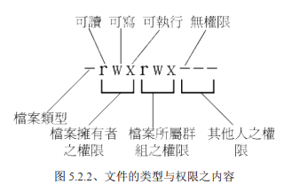

# 0-4. 暂且省略

[toc]

## 5. Linux 的文件权限与目录配置

### 5.1 使用者与群组

三个重要的文件存放着重要的信息:

- `/etc/passwd 所有的系统上的账户与一般身份使用者`
- `/etc/shadow 个人的密码`
- `/etc/group 所有的组名`

### 5.2 Linux 文件权限概念

- 文件的类型与权限之内容：
   - 第一个字符：[d-lbc]
  d：目录 -：文件
  l：软链接
  b：可随机存取装置
  c：一次性读取装置

        - 下面的字符，以三个为一组 [rwx]的 参数组合。
        第一组：文件拥有者可具备的权限
        第二组：加入此群组之账号所拥有的权限
        第三组：非本人且没有加入本群组之其他账号的权限。

- 改变文件属性与权限
  - chgrp ：改变文件所属群组
  - chown ：改变文件拥有者
  - chmod ：改变文件的权限, SUID,SGID, SBIT 等等的特性

```shell
$ chown [-R] 账号名称 文件或目录
$ chown [-R] 账号名称:组名 文件或目录
$ chown root:root file
```

- 改变权限，chmod

```shell
# 数字类型改变权限
# r:4, w:2, x:1
$ chmod [-R] xyz 文件或目录
$ chmod 777 .bashrc
# 使用符号改变文件权限
$ chmod [ugoa][+-=][rwx] 文件或目录
# [ugoa] 分别代表，user，group，other，和 all。
$ chmod u=rwx,go=rx .bashrc
$ chmod a+w .bashrc
```

- 目录与文件之权限意义

  - r (read)：可读取此一文件的实际内容，如读取文本文件的文字内容等；
  - w (write)：可以编辑、新增或者是修改该文件的内容(但不含删除该文件)；
  - x (eXecute)：该文件具有可以被系统执行的权限。

| 组件 | 内容     | 迭代物件   | r          | w            | x                     |
| ---- | -------- | ---------- | ---------- | ------------ | --------------------- |
| 文件 | 详细资料 | data       | 文件文件夹 | 读到文件内容 | 修改文件内容          | 执行文件内容 |
| 目录 | 檔名     | 可分类抽屉 | 读到档名   | 修改檔名     | 进入该目录的权限(key) |
