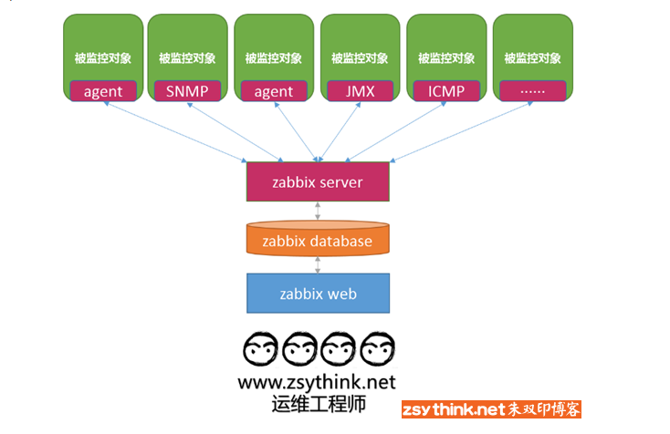
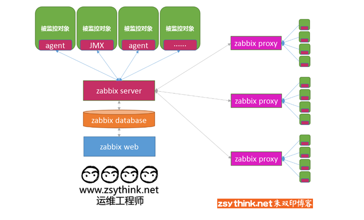

目录：

[toc]

<a href="#bottom" target="_self">
<u>前往底部</u>
</a>

# zabbix 朱双印学习笔记

## zabbix 概念

- 监控对于运维来说非常重要，需要保证业务系统的稳定运行，就要实时关注相关的指标是否正常。
  - 监控业务系统背后的服务器、网络设备等 硬件资源。
  - 更方便、集中的监控业务系统。
  - 具备采集信息、存储信息、展示信息、报警通知等功能。

### zabbix 支持哪些通讯方式

对于不同的设备或者操作系统，监控软件想监控这些对象，则需要通过各种方法与他们进行通讯。  

- zabbix 支持的通讯方式：
  - agent：专用的代理程序进行监控，与 master/agent 模型类似，监控对象支持，首选。
  - ssh/telnet：通过远程控制协议进行通讯，ssh 或者 telnet。
  - SNMP(Simple Network Management Protocol)：一种久远的、通行的协议，译为“简单网络协议”。在路由器、交换机这种硬件上无法安装 agent，但是这些硬件都支持 SNMP 协议。SNMP 协议的工作模式可以理解为 master/agent 的工作方式， 只不过是这些设备中内置了 SNMP 的 agent，所以大部分的网络设备都支持这个协议。
  - IPMI：通过 IPMI 接口进行监控。
  - JMX：通过 JMX 进行监控，JMX(Java Management Extensions,即 Java 管理扩展)，监控 JVM 虚拟机。

由 agent 采集数据，报告给监控主机 master。负责监控的中心主机为 `zabbix server`,zabbix 的数据库为 `zabbix database`，展示平台 GUI 为 `zabbix web`，`zabbix web` 使用 php 编写，所以需要依赖 LAMP 环境，如下图。
> 

- 当监控规模变得异常庞大的时候，zabbix 支持 分布式监控，把监控对象分成不通的区域，每个区域设置一台代理主机。监控对象的信息被 agent 收集发送给 代理主机（相当于 `zabbix server`），被称为 `zabbix proxy`， `zabbix proxy` 在收集数据发送给真正的代理主机 `zabbix server`，机构如下。

> 

## zabbix 组件及工作模式

- zabbix 的几个核心组件
  - `zabbix agent`：部署在监控主机上

<a href="#jump" target="_self">
<u>返回顶部</u>
</a>

